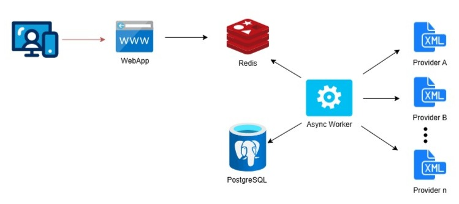

# Technical Assessment

After reviewing and validating proposed documentation, the approach followed to complete the assignment was to implement a solution based in 2 main components:
  
* **Async-Worker process**: Asynchronous process that retrieves a list of available plans (in XML format) from multiple providers and stores them in both Redis Cache and the PostgreSQL database.
  
* **Web Application**: Web server application that exposes endpoints for interacting with the events platform.

See architecture diagram below:

## Architecure Diagram

## Project Dependencies
* Docker and docker-compose (either plugin or standalone)
* Rust

## Technology Stack - Main crates
* Asyync-Worker Process
  * [Diesel ORM](https://diesel.rs)
  * [Tokio Async Runtime](https://tokio.rs/)

* Web Application
  * [Actix Web](https://actix.rs/)  
  * [Tokio Async Runtime](https://tokio.rs/)

## Solution deployment

Please find here [deployment guide](./deployment-guide.md) to get the solution running locally.

---------------------------------------------------------

## The extra mile

### How to scale this application focusing on performance
1. **Measure**: Performance testing, use tools like `Gatling` to simulate multiple users
2. **Monitor**:
    - Use tools like `Prometheus` and `Grafana` to monitor WebApp and `RedisInsight` and `Sentinel` to monitor Redis
3. **Mitigate**:
    - Increase number of Actix-Web worker instances
    - Implement multiple Web-Servers hosting the WebApp component and incorporate Load Balancer capabilities.
    - _Redis_:
      - Redis Sentinel: monitoring and failover configuration
      - Partitioning (sharding)
      - Replication (data redundancy and read scalability)
      - Persistence configuration (AOF, RDB)
      - Redis cluster (vertical and horizontal scalability)

### How to scale this application focusing on adding new providers
1. Increase the instances of Async-worker to store and retrieve the data from the new added providers.

### How to scale this application focusing on traceability
1. **Logging**:
    - Use `Correlation ID` to track requests across services
2. **Monitoring**: Use `Datadog` to have a record of events and errors and persists them in the database in the
sequence they occurred. This can be used to replay events and restore the state of the application.
1. **Tracing**:
    - Use `Jaeger` to trace requests across services
    - Use `OpenTelemetry` to instrument the code

## Features implemented:
### Performance
- [X] Async Worker (multiple instances can be launched)
- [X] Web App (multiple workers can be added to Actix-Web server)
- [X] Cache

### Consistency, availability and scalability 
- [X] Persistency in Redis
- [X] Persistency in Postgresql

### Code Quality (error handling, logging, set up, etc)
- [X] Configuration
- [X] Isolated environment to run (Docker)
- [X] Package manager (cargo)
- [X] Basic error handling (fetching and XML parsing, database access, etc.)
- [X] Retry
- [X] Transaction (Redis pipe)
- [X] Basic Logging
- [X] Testing
- [X] Code coverage
- [X] Linting
- [X] Formatting

## Future work
  * Add performance testing
  * Add penetration testing
  * Add monitoring and tracing
  * Add security (OAuth 2.0, JWT, https, throttling)
  * Redis Fetching in batching
  * Improve description in error handling parsing XML

------------------------------------------------------------------------------------------------------------------------

# Comments

1. **Ensuring Requirement Compliance**: It is essential to ensure that all project requirements—such as retrieving past events and filtering online events—are completely fulfilled to meet stakeholder expectations and achieve project objectives.
2. **Optimizing Provider Separation**: Further separating providers across different business areas in terms of data persistence would be advantageous. Developing a normalized model for the Fever application would enable more efficient modeling, transformation, and importing of events from the internal providers service. This approach would optimize event retrieval endpoints and enhance overall performance.
3. **Improving Test Coverage**: Adding tests for key scenarios—such as updating event properties and managing transitions between online and offline states—will help achieve more comprehensive test coverage and reduce the risk of undetected bugs.
4. **Optimizing Implementation for Use Cases**: Addressing implementation limitations—such as Redis caching without a TTL (*permanently store*) will produce a constant growth of the memory allocation needs.
7. **Applying the Single Responsibility Principle (SRP)**:Separating tests from source code and enforcing SRP at the file level will enhance code maintainability, readability, and testability. This approach will also support better collaboration and help minimize technical debt over time.

------------------------------------------------------------------------------------------------------------------------
